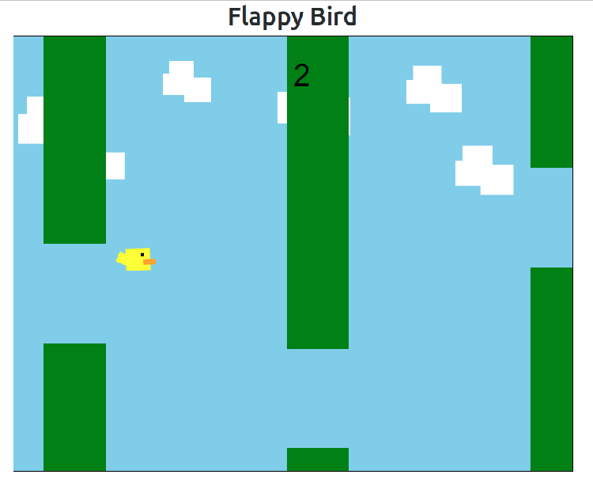
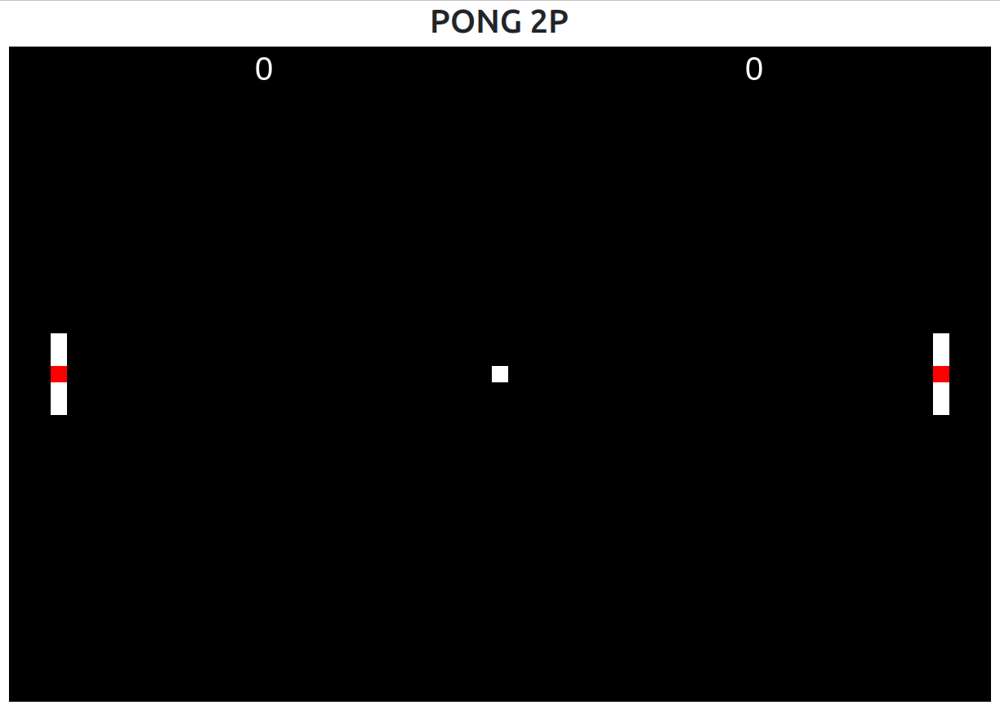
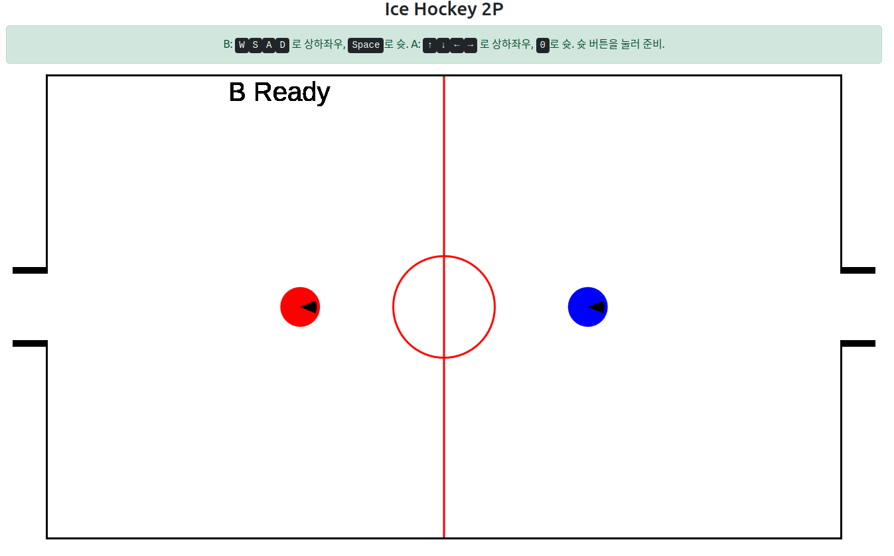
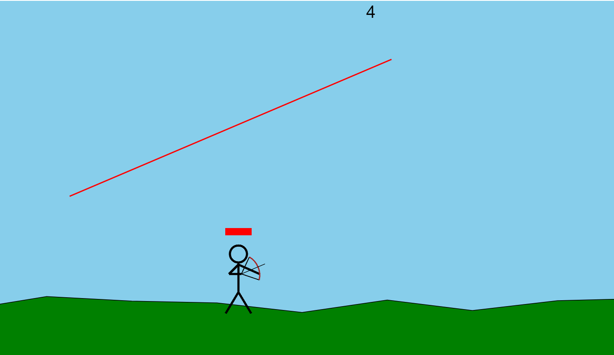

# Html-Games

Games that I made when I was bored haha

---
## 1. Flappy Bird

### [Play](https://jellyho.github.io/Html-Games/Flappy_Bird.html)

### [Code](https://github.com/jellyho/Html-Games/blob/master/Flappy%20Bird.html)

---
## 2. PONG 2P

### [Play](https://jellyho.github.io/Html-Games/Pong2P.html)

### [Code](https://github.com/jellyho/Html-Games/blob/master/Pong2P.html)

---
## 3. Ice Hockey 2P

### [Play](https://jellyho.github.io/Html-Games/IceHockey.html)

### [Code](https://github.com/jellyho/Html-Games/blob/master/IceHockey.html)

---
## 4. Archer 2P

### [Play](https://jellyho.github.io/Html-Games/archer.html)

### [Code](https://github.com/jellyho/Html-Games/blob/master/archer.html)

---
## 5. Wordle

### [Play](https://jellyho.github.io/Html-Games/wordle.html) 

### [Code](https://github.com/jellyho/Html-Games/blob/master/wordle.html)
