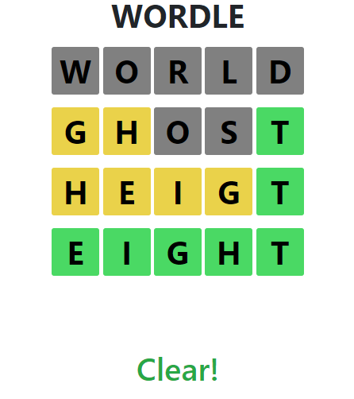

# Html-Games

Games that I made when I was bored haha

---

<table>
  <tr>
    <td align="center">
      <strong>1. Flappy Bird</strong> 
       
      <a href="https://jellyho.github.io/Html-Games/Flappy_Bird.html">Play</a> | 
      <a href="https://github.com/jellyho/Html-Games/blob/master/Flappy%20Bird.html">Code</a>
    </td>
    <td align="center">
      <strong>2. PONG 2P</strong> 
       
      <a href="https://jellyho.github.io/Html-Games/Pong2P.html">Play</a> | 
      <a href="https://github.com/jellyho/Html-Games/blob/master/Pong2P.html">Code</a>
    </td>
  </tr>
  <tr>
    <td align="center">
      <strong>3. Ice Hockey 2P</strong> 
       
      <a href="https://jellyho.github.io/Html-Games/IceHockey.html">Play</a> | 
      <a href="https://github.com/jellyho/Html-Games/blob/master/IceHockey.html">Code</a>
    </td>
    <td align="center">
      <strong>4. Archer 2P</strong> 
       
      <a href="https://jellyho.github.io/Html-Games/archer.html">Play</a> | 
      <a href="https://github.com/jellyho/Html-Games/blob/master/archer.html">Code</a>
    </td>
  </tr>
  <tr>
    <td align="center" colspan="2">
      <strong>5. Wordle</strong> 
       
      <a href="https://jellyho.github.io/Html-Games/wordle.html">Play</a> | 
      <a href="https://github.com/jellyho/Html-Games/blob/master/wordle.html">Code</a>
    </td>
  </tr>
</table>
